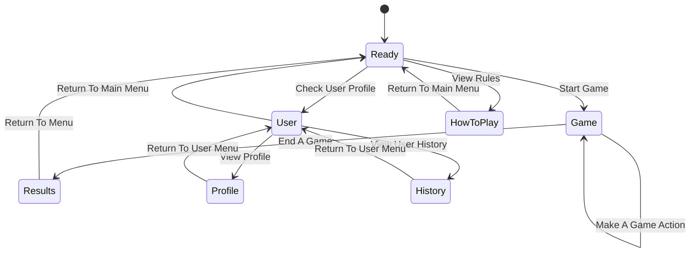

## TeamName
<!--The name of your team.-->
We are the CS-506 Anteaters
### Project Abstract

<!--A one paragraph summary of what the software will do.-->

This project looks to implement the 1973 board game *Boggle* in an online, multiplayer format. In addition to implementing all of the expected game mechanics, we seek to include modern amenities common to online games, including online matchmaking, seeded *Boggle* boards, and user accounts, including score tracking and win rates.

<a href=https://en.wikipedia.org/wiki/Boggle>*(From Wikipedia)*</a>

### Customer

<!--A brief description of the customer for this software, both in general (the population who might eventually use such a system) and specifically for this document (the customer(s) who informed this document). Every project will have a customer from the CS506 instructional staff. Requirements should not be derived simply from discussion among team members. Ideally your customer should not only talk to you about requirements but also be excited later in the semester to use the system.-->
Customer research has not yet been conducted. The target audience are *Boggle* players who seek a modern, online version of the traditional board game.

### Specification

WIP

#### Technology Stack

```mermaid
flowchart RL
subgraph Front End
	A(Javascript: React)
end
	
subgraph Back End
	B(Java: Spring Boot)
end
	
subgraph Database
	C[(MySQL)]
end


#### Database

| Table | Column        | Type   |
|------:|---------------|--------|
| User  | user_name     | string |
| User  | password      | string |
| User  | matches_won   | int    |
| User  | highest_score | int    |

#### Class Diagram

```mermaid
classDiagram
direction TB

class User {
  - String userName
  - String passwordHash
  - int matchesWon
  - int highestScore
  + User(userName: String, passwordHash: String)
  + getUserName() String
  + checkPassword(password: String) bool
  + getMatchesWon() int
  + getHighestScore() int
}

class Player {
  - int currentScore
  - List~String~ submittedWords
  + Player(userName: String, passwordHash: String)
  + submitWord(word: String) bool
  + resetForNewGame() void
  + getCurrentScore() int
}

class Dictionary {
  - Set~String~ words
  + Dictionary(sourcePath: String)
  + contains(word: String) bool
  + addWord(word: String) void
  + load(sourcePath: String) void
}

class Game {
  - String gameId
  - char[][] board
  - List~Player~ players
  - Dictionary dictionary
  - Timer timer
  + Game(gameId: String, dictionary: Dictionary, roundSeconds: int)
  + start() void
  + end() void
  + addPlayer(p: Player) void
  + removePlayer(p: Player) void
  + validateWord(p: Player, word: String) bool
  + getCurrentTime() int
}

User <|-- Player
Game o-- Dictionary
Game o-- Player
```

#### Behavior



### Standards & Conventions

<!--This is a link to a seperate coding conventions document / style guide-->
[Style Guide & Conventions](STYLE.md)
