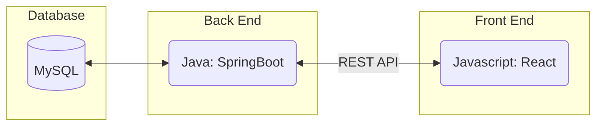

Here is where you will explain your plan for the Walking Skeleton.

We will talk more about this in the future. In summary, the Walking Skeleton is a plan for setting up a minimal version of your tech stack. This is less than a MVP (minimum viable product) as this is not meant to be a product. It is to prove that you are able to integrate the three main components of your application: front end, back end, and database.

To complete the Skeleton you must be able to interact with your front end, have that interaction be sent to your backend, have something be stored in your database, and return a result back to the front end. This feature does not have to be particularly powerful or meaningful, but you must prove that you can communicate between each component of your application.

1. Setup a React project w/ Javascript, make simple login page
2. Setup backend Java Springboot, be able to recieve and send information to the frontend
3. Setup SQL database, be able to store and recieve information between backend and database (account info)
4. Create a get account feature in frontend (React) to get high score value of an account when user inputs a username
5. Send username info to backend, which will request the high score value from the database, send information to frontend for display
